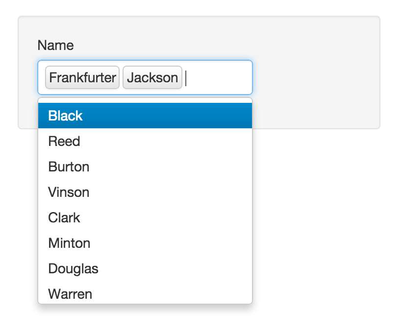
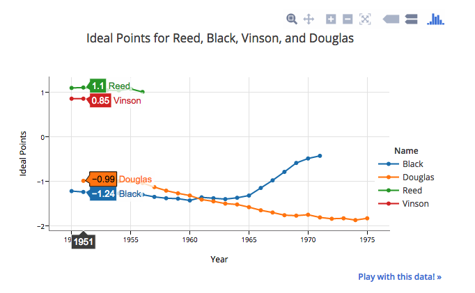
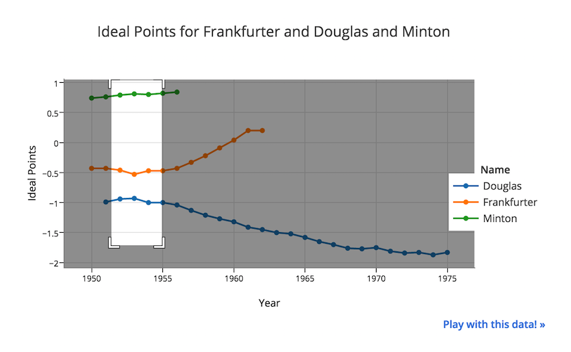
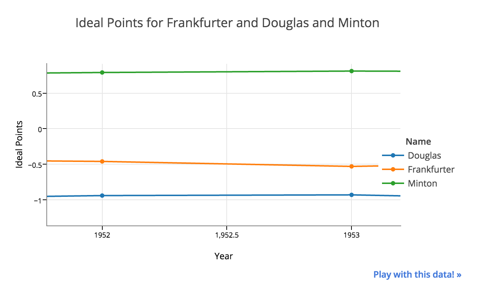

# IdealPoints Data Visualization
This repo is an interactive data visualization project for Prof. Bailey. 

# Features
Clients can select name(s) of justice of interest when they want to compare their ideal points.


Screen shot for comparison multiple justices


Zoom-in plot



# How to use
1. Download the repo as a zip file (or clone it)
2. Set the `IdealPoints` folder as the working directory.
3. Change the API key in `server.R` to an active one (see email).
4. Install `plotly` package (see code below)

    ```r
    # Install and load the devtools package. 
    install.packages("devtools")
    library("devtools")

    # install plotly
    install_github("ropensci/plotly")
    ```

5. Call `shiny` inside R
    ```r
    shiny::runApp()
    ```
